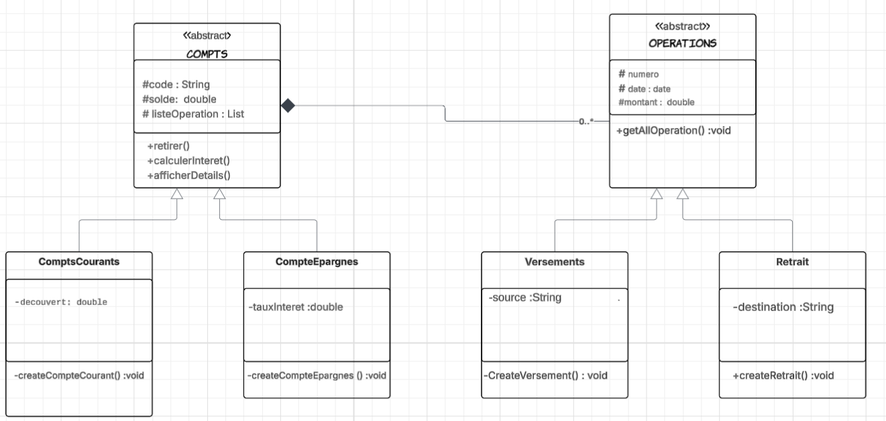

# Gestion Bancaire - Application Console Java

## 📌 Description du projet
Ce projet a pour objectif d’automatiser la gestion des comptes bancaires via une **application console en Java 8**.  
Il permet de créer et gérer des comptes, ainsi que d’effectuer différentes opérations telles que les **versements**, **retraits** et **virements** entre comptes.

Deux types de comptes sont disponibles :
- **Compte Courant** : possibilité de découvert, sans calcul d’intérêts.
- **Compte Épargne** : calcul d’intérêts avec un taux prédéfini.

Chaque opération est historisée et accessible via un menu interactif.

## 🛠️Diagramme de classes ## 


---

## 🛠️ Technologies utilisées
- **Java 8**
- **JDBC** pour la connexion à MySQL
- **HashMap** → stockage rapide des comptes
- **ArrayList** → historique des opérations
- **Java Time API** → gestion des dates
- **Gestion d’exceptions (try-catch)**
- **Fichier texte** (`.txt`) → stockage des codes pour éviter les doublons
- **Random** → génération de codes de compte uniques
- **Git** → gestion de version
- **Jira** → suivi des tâches
- Bonus : **Stream API**, **Lambda Expressions**, **Optional**

---

## 📂 Structure du projet
Le projet adopte une architecture **MVC simplifiée** :

./src
│
├─ model # Classes métier (Compte, CompteCourant, CompteEpargne, Operation, Versement, Retrait)
├─ controller # Logique de contrôle, interaction entre View et Service
├─ service # Logique métier (intérêts, retrait, versement, virement)
├─ view # Interface utilisateur console (menus)
└─ main # Point d’entrée de l’application (Main.java)

---

## 🚀 Fonctionnalités principales
1. Création de comptes (courant ou épargne) avec code unique (`CPT-XXXXX`)  
2. Versement sur un compte  
3. Retrait avec règles spécifiques selon le type de compte  
4. Virement entre comptes  
5. Consultation du solde  
6. Consultation de l’historique des opérations  
7. Validation et gestion des erreurs (montants positifs, format des codes, saisies incorrectes)  
8. Persistance des données en mémoire avec option **MySQL**  

---

## ✅ Prérequis
- **Java JDK 8** installé  
- **MySQL** (optionnel, pour la sauvegarde des données)  
- **IDE** recommandé : IntelliJ IDEA, Eclipse ou NetBeans  
- **Git** pour cloner le projet  

---

## ⚙️ Installation et exécution

1. **Cloner le dépôt GitHub** :
```bash
git clone https://github.com/lakrounehamza/App-Java-Console-Gestion-des-comptes-bancaires
cd App-Java-Console-Gestion-des-comptes-bancaires

- **Compiler le projet** :
javac -d bin ./src/main/*.java ./src/model/*.java ./src/service/*.java ./src/controller/*.java ./src/view/*.java
Exécuter l’application
java -cp bin main.Main

